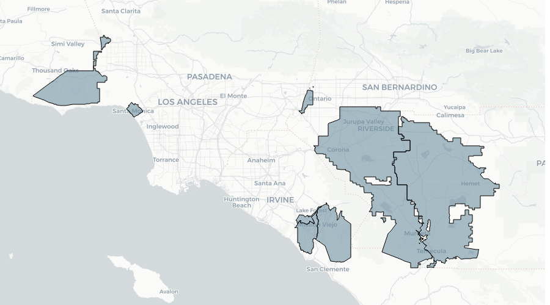

```{r setup, echo=FALSE, message=FALSE, warning=FALSE}
library(magrittr)
library(ggplot2)
library(dplyr)
library(leaflet)
library(ggmap)
library(plotly)
library(leaflet.extras)
library(rpostgis)
library(mapview)
#source("config/dbconfig.R")
source("R/plots.R")

conn<-dbConnect("PostgreSQL",dbname = Sys.getenv("GREY_SCUBA_DBNAME"),
                            port = Sys.getenv("GREY_SCUBA_PORT"),
                            user = Sys.getenv("GREY_SCUBA_USER"),
                            password = Sys.getenv("GREY_SCUBA_PASS"),
                            host = Sys.getenv("GREY_SCUBA_HOST"))

utility_geoms <- get_scuba_utility_polygons(conn)

tmp <- get_qc_data(conn)

cust_counts <- tmp %>% dplyr::select(utility_name, cust_count, month) %>%
  tidyr::spread(key=month, value=cust_count) %>%
  dplyr::filter(!is.na(utility_name))
namelist <- cust_counts$utility_name
cust_counts <- dplyr::select(cust_counts, -utility_name)
row.names(cust_counts) <- namelist
tmpcols <- colnames(cust_counts)
tmpcols <- paste(substr(tmpcols,1,4),substr(tmpcols,5,6), sep="-")
for(i in 1:ncol(cust_counts) ){
  if(i %% 3 != 1){
    tmpcols[i] <- ""
  }
}
colnames(cust_counts) <- tmpcols

avg_counts <- tmp %>% filter(usage_year >= 2015) %>% 
  group_by(utility_name) %>% summarise(count=mean(cust_count, na.rm=TRUE))
```


The SCUBA data warehouse serves as a central repository for granular water use information from local water utilities in California, as well as for related contextual datasets. 

## Overview of data in SCUBA

The data include regular monthly/bimonthly billing information such as amount of water consumed, date of use, and customer classification. Some utilities also provide context such as evapotranspiration, household size and landscape area. Utility-specific customer classes have been standardized into statewide classifications aligned with the Department of Water Resources (single family residential, multi-family residential, commercial, industrial, irrigation, institutional and other). 

In many cases information is also available about which customers participated in water efficiency rebate programs like turf removal or high efficiency toilet rebates and the date of their participation. 

In addition, SCUBA enriches utility-provided data with key contextual attributes. This includes socioeconomic information from the American Community Survey (ACS), reference evapotranspiration from the California Irrigation Management Information System (CIMIS) and latitude/longitude information obtained by geocoding customer addresses.

SCUBA currently holds metered use for `r nrow(utility_geoms)` retailers, shown in the table and maps (Figures 1 & 2) below:

```{r, echo=FALSE}
# for (u in sort(utility_geoms$supplier_n) ){
#   cat(paste("*", u[[1]], "\n", sep = " " ))
# }

knitr::kable( as.data.frame(list("Supplier"=utility_geoms$supplier_n, "Acronym"=utility_geoms$utility_name)) )
```


```{r, echo=FALSE}
m <- plot_scuba_utilities(-118, 33.7, 9)
mapshot(m, file="utilities1.png",  cliprect = c(50, 100, 900, 500))


m <- plot_scuba_utilities(-122, 38.5, 9)
mapshot(m, file="utilities2.png",  cliprect = c(150, 100, 800, 400))
```





The heatmap in Figure 3 below shows a high-level overview of water use data in SCUBA. The x-axis displays months going forward in time while the y-axis labels each utility. Color corresponds to the number of meter reads in each month, normalized for each row where dark blue to purple indicate more customers and orange to red indicate fewer. A number of data quality issues that would be of interest to researchers using SCUBA metered use data are highlighted in red text.


```{r, echo=FALSE, fig.width=20, fig.height=8}
# d3heatmap::d3heatmap(cust_counts, scale="row", Rowv=NA, Colv=NA, col=rainbow(256))
```


In general, most utilities have provided at least 6 years of continuous data, with some providing much more and some having less actionable data because of data quality issues. For months where all data is available, an average of $`r as.integer( round(sum(avg_counts$count, na.rm = TRUE), -3) )`$ customer accounts are represented in the data.

### Plans for Future Expansion

* More granular commercial and industrial categorizations (e.g. restaurant, hospital, church, etc.)

* Higher resolution evapotranspiration by utilizing spatial CIMIS or other future sources instead of readings directly from CIMIS stations.


### Example studies and potential questions

We are always open to creative new applications, but please see the following links for some ideas for potential questions to answer using this data.

http://californiadatacollaborative.org/blog/2016/7/19/request-for-ideas-demand-effects-of-water-rates

### Data Sharing

Data may be provided at no cost to qualified researchers with explicit written permission from member utilities. If you would like to gain access to data, please complete the data access application located here:

https://goo.gl/forms/PmiBomvG68qh7je63

Access to enriched public data is relatively simple. For requests to access secure data (customer metered use) your proposal will be circulated with utility staff and you may be asked to discuss your ideas in a call or webinar with whichever of our Data Action Teams is most relvant to your proposal. Interested member utilities will provide their written consent, and you will need to sign a nondisclosure agreement.

This process is expected to take several months, after which you will be provided with data from all utilities who have given their consent. Please reach out to info@CaliforniaDataCollaborative.com with any requests.

```{r, echo=FALSE, fig.height=3}
# ggplot(avg_counts %>% filter(!is.nan(count)) %>% arrange(desc(count)) %>% mutate(utility_name = as.ordered(utility_name)), aes(utility_name, count)) + geom_col()

ggplot(avg_counts %>% filter(!is.nan(count)) %>% mutate(utility_name = as.factor(utility_name)),
       aes(x=reorder(utility_name, count, sum), y=count)
       ) + 
  geom_col() + ggtitle("Average Monthly Retail Customer Counts Available from Each Utility") +
  xlab("") + ylab("Count")
  
```


## Partial Data Dictionary

#### Usage data

 Data Field | Description   
| ----------------------------- | -------------------------------------------------------------------- 
|cust_id_from_utility | unique id for each customer assigned by the utility
|usage_et_amount | reference evapotranspiration (inches) rpovided by utility
|usage_outdoor_budget_ccf |CCF allocated in outdoor tier of water budget rate structure 
|usage_indoor_budget_ccf|CCF allocated in the indoor tier of water budget rate structure 
|usage_total_bill|total price paid for that billing period
|usage_start_date|beginning date in the billing period
|usage_end_date|ending date in the billing period
|usage_month|month of the ending date
|usage_year|year of the ending date
|usage_ccf|amount of water used between start and ending date 
|cust_loc_id|unique ID for accounts that changes to track attribute changes
|cust_loc_class_from_utility|customer rate code from the utility
|usage_et_amount_default|reference evapotranspiration (inches) from nearby CIMIS stations

### Customer/Account Information

 Data Field | Description   
| ------------------------------- | -------------------------------------------------------------------------- 
|cust_loc_class_from_utility |customer rate code from the utility
|cust_loc_class |standardized customer classification aligned with DWR
|cust_loc_hhsize|number of residents used for setting the indoor water budget
|cust_loc_water_type|potable / raw / recycled
|cust_loc_is_master_meter|whether a meter measures use from multiple units
|cust_loc_irr_area_sf|square feet of irrigable area for that customer
|cust_loc_apn|assessor parcel number for the customer’s location
|cust_loc_street_num|Street number from address
|cust_loc_street_name|Street name from address
|cust_loc_city|City from address
|cust_loc_zip|Zip code from address
|cust_loc_info_start_date|he day a new customer’s info begins
|cust_loc_info_end_date|the day the customer leaves that location
|et_zone_from_utility|Et zone or CIMIS station number used for the customer
|cust_loc_latitude|Geographic coordinates of a customer or meter
|cust_loc_longitude|Geographic coordinates of a customer or meter
|cust_loc_meter_size|size of the meter delivering to the customer
|cust_loc_pressure_zone|pressure/elevation/pumping zone for a customer


### Rebate Program Data

 Data Field | Description   
| -------------------------------- | --------------------------------------------------------------------- 
|rebate_instance_type|Type of rebate (turf, high efficiency clothes washer, weather based irrigation controller, etc.)
|rebate_instance_payment|Amount paid by the rebate
|rebate_instance_quantity|Amount rebated (number of square feet of turf removed, devices replaced, etc.)
|rebate_instance_post_date|Date the post inspection occurred
|cust_id_from_utility|Unique ID the utility assigns to the customer that took the rebate
|location_id_from_utility|Unique ID the utility assigns to the location where the rebate occurred
|rebate_instance_check_date|Date the rebate check was issued
|rebate_instance_received_date|Date the rebate application was received

### American Community Survey

Using the geocoded coordinates for each customer, the utility data above can be joined with socioeconomic information from the American Community Survey (ACS). SCUBA currently contains the following data from the 2015 ACS 5-year survey for each census block group in California.

 Data Field | Description   
| -------------------------------- | --------------------------------------------------------------------- 
|pop_density_acs_2015|Population density 
|total_population|Total population
|total_households|Total number of households
|avg_hhsize|Average household size
|pop_25_and_over|Population over age 25
|education|Counts and percentages in several educational attainment categories (less than high school, bachelor's degree, etc)
|median_hh_income|Median household income
|median_year_structure_built|Median year of construction for homes

### Water Rate Structure

The CaDC has also begun the process of collecting detailed water pricing information for utilities through California. This data us recorded using the [Open Water Rate Specification](https://github.com/California-Data-Collaborative/Open-Water-Rate-Specification) (OWRS) and is available to the public [here](https://github.com/California-Data-Collaborative/Open-Water-Rate-Specification/tree/master/full_utility_rates/California). The easiest way to analyze this data is using [RateParser](https://github.com/California-Data-Collaborative/RateParser) - a software package written in the `R` programming language that takes as input water usage data (like that stored in SCUBA) and OWRS data to calculate water bills. Using this approach is it possible to easily calculate the usage and marginal cost of water in different pricing tiers, both within and across utilities.

### Utility-level Usage Data (supplier_report)

Monthly water production for California's major urban water suppliers [obtained from](https://data.ca.gov/dataset/drinking-water-%E2%80%93-urban-water-supplier-monitoring-%E2%80%93-drinc) the State Water Resources Control Board. This data is then enriched with context like average evapotranspiration from nearby CIMIS stations and landscape area from the CaDC/CGU land cover data set. This data powers the CaDC [Statewide Efficiency Explorer](http://californiadatacollaborative.org/statewide-efficiency/). 

 Data Field | Description   
| -------------------------------- | --------------------------------------------------------------------- 
|report_id|Unique ID for each monthly usage record
|report_agency_name|Name of the urban water supplier
|report_pwsid|The primary unique identifier of the urban water supplier (may have more than one system)
|report_hydrologic_region|Name of the principal hydrologic region in the state (10 total) encompassing the supplier
|report_has_restrictions|Mandatory restrictions on outdoor irrigation
|report_actions_implemented|Description of the enforcement actions taken by the water supplier to meet conservation standards
|report_total_production_af|Total amount of potable water produced during the Reporting Month in acre-feet
|report_total_production_af_2013|Total amount of potable water produced during the same Reporting Month in 2013 in acre-feet
|report_cii_production_af|Amount of potable water used by commercial, industrial, and institutional customers during the Reporting Month in acre-feet
|report_ag_production_af|Amount of potable water used for commercial agriculture during the Reporting Month in acre-feet
|report_ag_production_af_2013|Amount of potable water used for agriculture during the same Reporting Month in 2013 in acre-feet
|report_recycled_production_af|Amount of recycled water beneficially used during the Reporting Month in acre-feet
|report_population|Estimate of the number of permanent residents served potable water during the Reporting Month
|report_percent_residential|Percentage of total water production that went to residential customers during the Reporting Month
|report_gpcd_reported|Supplier estimate of the number of residential gallons-per-capita-day for the Reporting Month
|report_gpcd_calculated|Calculated R-GPCD in accordance with the formula (Current Production * Percent Residential Use)/(Days-in-Month * Population Served)
|report_ag_cert|Indication that the supplier has exemption to reduce current and 2013 production by current and 2013 agricultural water use respectively
|report_production_calculated|The Production_Reported converted to gallons and adjusted by Ag_Cert exemption
|report_production_calculated_2013|The 2013_Production_Reported converted to gallons and adjusted by Ag_Cert exemption
|report_percent_reduction|Water supplier’s state-mandated target percent reduction in water consumption since June 2015 through the most recent Reporting Month relative to the same period in 2013
|report_complaints|Number of water waste or violation of conservation rules complaints received by the supplier during the Reporting Month
|report_followups|Number of follow-up activities to Complaints done by the supplier during the Reporting Month
|report_warnings|Number of drought-related conservation warnings issued to customers by the supplier during the Reporting Month
|report_penalties_rate|Number of fines issued to consumers for using water over a certain allocation as part of the supplier rate structure during the Reporting Month
|report_penalties_other|Number of penalties issued by the supplier during the Reporting Month for violations of local ordinances and/or the Water Board’s statewide prohibitions
|report_irr_area_sf|Parcel-level square footage of residential turf, shrubs and trees aggregated to utility-level
|report_eto|Inverse distance-weighted average of ET readings from nearest CIMIS stations
|utility_id|Unique id assigned to each supplier by CaDC
